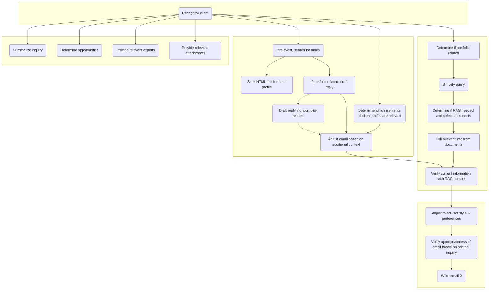

# Advise AI
Advise AI is an email-based assistant designed to help financial advisors serve their clients more effectively. By forwarding a client's email to Advise AI, advisors receive a response with relevant content tailored to the client's inquiry.

The assistant.py script uses the Microsoft Graph API to authenticate and access the Outlook account, processes the email content using numerous ChatGPT instances, and then uses SendGrid's API to send the generated content to the advisor. The script continuously runs, automatically processing any unread emails in the inbox.

For demo purposes, the script is currently hosted and running as an always-on task on PythonAnywhere.com.

# OpenAI Assistants API

All LLM processing is done via the [Assistants API](https://platform.openai.com/docs/assistants/overview). I created a total of 28 assistants with different instructions, docs, and settings on the OpenAI Assistants platform. They exist on my OpenAI account.

Below is a depiction of the main LLM sequence that generates content in response to a client email. Each rectangle in the chart represents an instance of ChatGPT 4o.



*See openai-assistants.md for instructions passed to chatGPT at each instance in the sequence.*

# Other Necessary APIs/Services

The project also relies on:
- **Calendly API:** fetches availability from advisor's google calendar
- **Google Calendar API:** schedules events in advisor's calendar
- **Google Maps API:** determines address of restaurants in advisor's profile and calculates live driving time
- **Siteground:** Hosting provider for [commands list site](https://wealth-ai.xyz/commands-list/) and [demo info page](https://wealth-ai.xyz/info/)
- **Godaddy.com:** used to manage Microsoft 365 subscription for Outlook account, and is the domain provider for the sites mentioned above

# Other Key Files

**shared_data.json:** when processesing an inquiry, pieces of content are added to this dict so that they are accessible at latter points in the script, and so that they are stored and accessible for future inquiries.

**advisor_profile.json:** stores the advisor profile, updates in response to changes made via profilesite.py (a flask app that allows the user to edit the advisor profile via webpage - created for demo purposes).

**dashboard.py:** a flask app that creates a webpage dashboard for reviewing user interactions with Advise AI.

# Changing Client Profiles or Mutual Fund Library
Both are currently hardcoded near the top of *assistant.py*. To make additions/changes simply edit the code.

Note however, that in order for mutual fund reccomendations to be accompanied by a fund profile attachment, you need to add name of the fund and the link to the funds_html dict in *assistant.py*.

# Adding RAG Documents

Currently, the only document being used for RAG in responses is the Canadian Income Tax Act. In order to add a new document:

First, add the document name + description to the instructions for the assistant that determines which docs are relevant. Since you cannot edit the assistant on my account, you would need to recreate the assistant. Create a new assistant on the [OpenAI Assistants API platform](https://platform.openai.com/assistants) and copy the instructions below (+ add your new document to the instructions) and set temperature to 0.3.
```
You will be given a question a financial advisor received from a client. If the question can be easily answered without additional documents, output "No RAG needed." 

If the question requests specific information that the advisor will need to search for, determine which document/s are needed from the list below:

- Canadian Income Tax Act: a legal document from the government of Canada outlining laws regarding taxation. Should be used for any specific tax questions, including questions about how RRSP, RESP, RDSP, FHSA, and TFSA accounts work.

If one or more documents is needed, strictly output their names. Include no additional detail in your response.
```

Then create another assistant responsible for performing retrieval on the new document. Attach your document under 'File search', lower the temperature to about 0.6, and add these instructions:

```
You will be given a question. Extract the information from the attached documents that will be most relevant to answering this question. If the documents cannot be used to answer the question, simply output "N/A"
```

Once you've created these 2 new assistants, add their IDs to assistant.py (see section dedicated to this near the top of the script). The ID of the first assistant you created should replace the ID for *RAGneed_docselect* and the ID of the second assistant you created should be assigned to a new variable titled something like *DOC_docname*

And finally, navigate to the RAG section of the llm function and find...
```
docs = [
    {"Name": "Canadian Income Tax Act", "Bot":DOC_tax},
    ]
```

Add a new dict to this list, with your document's name and the variable containing the assistant ID for the assistant that performs retrieval for the document.

**Note: the document name in the assistant's instructions MUST be identical to the document name provided in this dict.**
